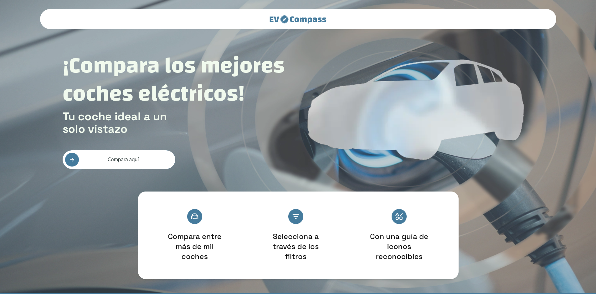
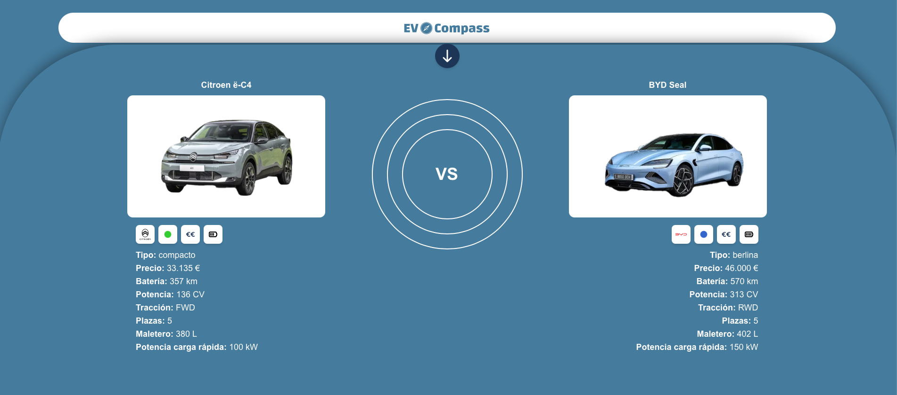
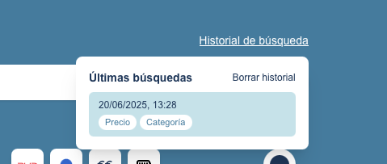

# Comparador de Vehículos Eléctricos

## Motivación

Este proyecto nace de dos intereses personales: por un lado, mi deseo de seguir aprendiendo sobre desarrollo web mediante tecnologías modernas como Next.js, Tailwind CSS y Neon, y por otro, mi afición por el mundo del automóvil, especialmente los vehículos eléctricos.

Durante la reciente compra de un coche eléctrico, me encontré con lo complicado que es comparar modelos de forma clara, sin verse abrumado por tecnicismos, anuncios o procesos de navegación engorrosos. Esto me motivó a crear una herramienta sencilla, visual y transparente que facilite esa decisión a otros usuarios.

---

## Demostración del funcionamiento

La aplicación está organizada en tres grandes bloques funcionales, diseñados para ofrecer una experiencia de usuario fluida y clara:

### 1. Página principal e introducción

La página de inicio presenta al usuario la propuesta del comparador de forma inmediata, con una interfaz moderna y adaptada a dispositivos móviles.



---

### 2. Búsqueda con filtros

El usuario puede filtrar los vehículos eléctricos por distintos criterios (tipo, precio, autonomía, etc.), y los resultados se actualizan al instante según las selecciones.


---

### 3. Comparador de vehículos

Al seleccionar hasta dos vehículos, el comparador aparece en la parte inferior de la pantalla y puede desplegarse para mostrar una tabla visual con las características clave comparadas (autonomía, potencia, maletero, etc.).



---

### 4. Historial de búsquedas

La aplicación recuerda automáticamente las búsquedas anteriores realizadas por el usuario, sin necesidad de registro, mediante cookies de sesión combinadas con la base de datos.



---

Cada una de estas funcionalidades está alineada con los objetivos definidos en el anteproyecto, permitiendo al usuario explorar, comparar y retomar búsquedas fácilmente, sin distracciones ni anuncios.

---

## Justificación de los objetivos alcanzados

### ✅ Introducción al comparador
- Se ha implementado una sección inicial visible al cargar la página donde se explica el propósito del proyecto de forma clara y visual.

### ✅ Búsqueda con filtros
- Los filtros por tipo de vehículo, precio, autonomía, etc., funcionan correctamente y actualizan los resultados en tiempo real.

### ✅ Comparador de características
- Se pueden seleccionar hasta 2 vehículos para comparar. El comparador aparece en la parte inferior y se despliega mostrando características como autonomía, tipo de carga, potencia, etc.

### ✅ Historial de búsquedas
- Se guarda un historial persistente vinculado a una cookie anónima, almacenado en la base de datos Neon.
- Al volver a entrar en la web, si la cookie sigue presente, se cargan las búsquedas anteriores automáticamente.
- Existe un botón para eliminar el historial si el usuario lo desea.

> Todos los objetivos han sido completados. No ha sido necesario eliminar funcionalidades ni modificar el alcance original.

---

## Descripción técnica

### Arquitectura

La aplicación sigue una arquitectura de **tres capas**:

1. **Capa de presentación (frontend)**: construida con Next.js (App Router), React y Tailwind CSS. Gestiona el renderizado de la interfaz y la interacción del usuario.
2. **Capa de lógica de negocio**: implementada con funciones server-side (SSR) y API Routes en Next.js, usando TypeScript.
3. **Capa de acceso a datos**: conexión con una base de datos PostgreSQL alojada en Neon, mediante consultas SQL.

---

### Tecnologías utilizadas

| Capa            | Tecnologías                        | Finalidad                                          |
|------------------|-------------------------------------|-----------------------------------------------------|
| Presentación     | Next.js, React, Tailwind CSS       | Renderizado de páginas, componentes visuales       |
| Lógica de negocio| API Routes, SSR, TypeScript        | Procesamiento de filtros, historial, comparador    |
| Acceso a datos   | PostgreSQL (Neon), SQL             | Almacenamiento y recuperación de búsquedas         |

---

### Herramientas auxiliares

- **Figma**: para diseño visual e interacción.
- **WebStorm**: entorno de desarrollo.
- **Postman**: pruebas de API.
- **GitHub**: control de versiones y despliegue.
- **Vercel**: hosting y despliegue automático.

---

### Diagrama de componentes

```mermaid
flowchart TD
    A[Usuario] -->|Interacción vía navegador| B[Interfaz Next.js (React + Tailwind)]
    B --> C[API Routes / SSR]
    C --> D[Base de datos Neon (PostgreSQL)]

    subgraph Frontend
        B
    end

    subgraph Backend
        C
    end

    subgraph Base de datos
        D1[cars table]
        D2[searches table]
        D1 --> D
        D2 --> D
    end
```

```mermaid
flowchart TD
    A[Usuario] -->|Interacción vía navegador| B[Interfaz Next.js (React + Tailwind)]
    B --> C[API Routes / SSR]
    C --> D[Base de datos Neon (PostgreSQL)]

    subgraph Frontend
        B
    end

    subgraph Backend
        C
    end

    subgraph Base de datos
        D1[cars table]
        D2[searches table]
        D1 --> D
        D2 --> D
    end
```
