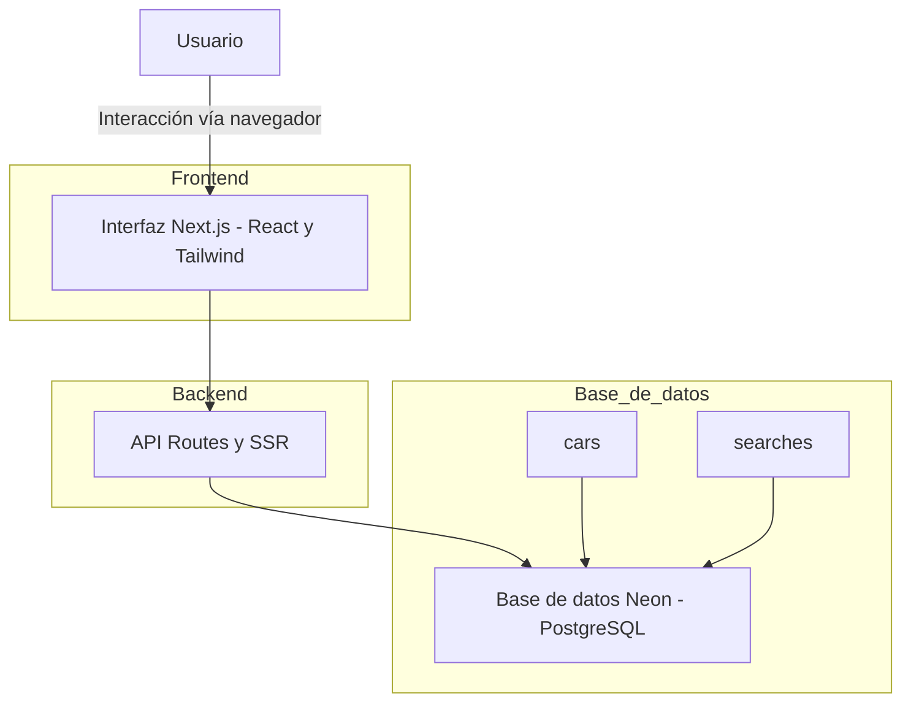
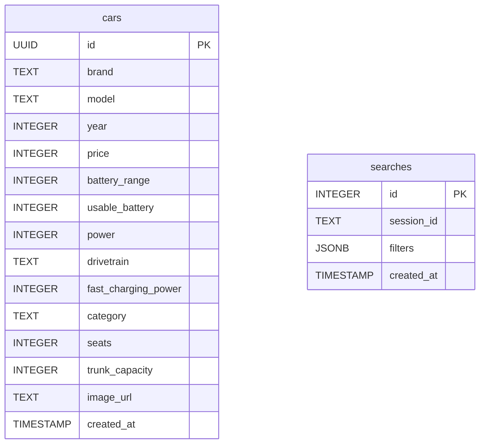
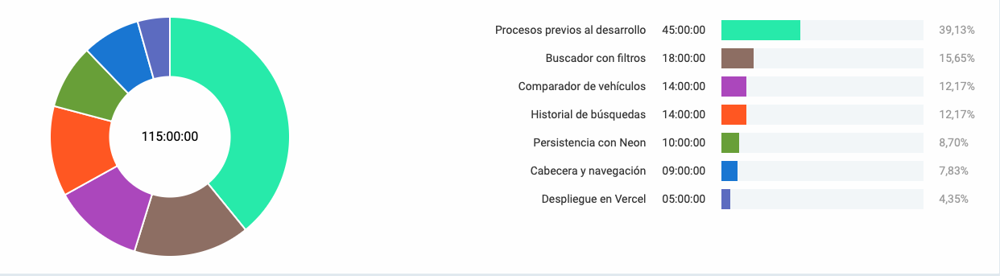

# EVCompass
> Comparador de vehículos eléctricos sencillo, claro y sin publicidad. Desarrollado con Next.js, Neon y Tailwind.

### 🟢 Aplicación desplegada
Puedes probar la versión actual de la aplicación aquí: [EVCompass](https://evcompass.vercel.app)

## Motivación

Este proyecto nace de dos intereses personales: por un lado, mi deseo de seguir aprendiendo sobre desarrollo web mediante tecnologías modernas como Next.js, Tailwind CSS y Neon, y por otro, mi afición por el mundo del automóvil, especialmente los vehículos eléctricos.

Durante la reciente compra de un coche eléctrico, me encontré con lo complicado que es comparar modelos de forma clara, sin verse abrumado por tecnicismos, anuncios o procesos de navegación engorrosos. Esto me motivó a crear una herramienta sencilla, visual y transparente que facilite esa decisión a otros usuarios.

---

## Demostración del funcionamiento

La aplicación está organizada en tres grandes bloques funcionales, diseñados para ofrecer una experiencia de usuario fluida y clara:

### 1. Página principal e introducción

La página de inicio presenta al usuario la propuesta del comparador de forma inmediata, con una interfaz moderna y adaptada a dispositivos móviles.

---

### 2. Búsqueda con filtros

El usuario puede filtrar los vehículos eléctricos por distintos criterios (tipo, precio, autonomía, etc.), y los resultados se actualizan al instante según las selecciones.

---

### 3. Comparador de vehículos

Al seleccionar hasta dos vehículos, el comparador aparece en la parte inferior de la pantalla y puede desplegarse para mostrar una tabla visual con las características clave comparadas (autonomía, potencia, maletero, etc.).

---

### 4. Historial de búsquedas

La aplicación recuerda automáticamente las búsquedas anteriores realizadas por el usuario, sin necesidad de registro, mediante cookies de sesión combinadas con la base de datos.

---

Cada una de estas funcionalidades está alineada con los objetivos definidos en el anteproyecto, permitiendo al usuario explorar, comparar y retomar búsquedas fácilmente, sin distracciones ni anuncios.

---

## Justificación de los objetivos alcanzados

### ✅ Introducción al comparador
- Se ha implementado una sección inicial visible al cargar la página donde se explica el propósito del proyecto de forma clara y visual.

### ✅ Búsqueda con filtros
- Los filtros por tipo de vehículo, precio, autonomía, etc., funcionan correctamente y actualizan los resultados en tiempo real.

### ✅ Comparador de características
- Se pueden seleccionar hasta 2 vehículos para comparar. El comparador aparece en la parte inferior y se despliega mostrando características como autonomía, tipo de carga, potencia, etc.

### ✅ Historial de búsquedas
- Se guarda un historial persistente vinculado a una cookie anónima, almacenado en la base de datos Neon.
- Al volver a entrar en la web, si la cookie sigue presente, se cargan las búsquedas anteriores automáticamente.
- Existe un botón para eliminar el historial si el usuario lo desea.

> Todos los objetivos han sido completados. No ha sido necesario eliminar funcionalidades ni modificar el alcance original.

---

## Descripción técnica

### Arquitectura

La aplicación sigue una arquitectura de **tres capas**:

1. **Capa de presentación (frontend)**: construida con Next.js (App Router), React y Tailwind CSS. Gestiona el renderizado de la interfaz y la interacción del usuario.
2. **Capa de lógica de negocio**: implementada con funciones server-side (SSR) y API Routes en Next.js, usando TypeScript.
3. **Capa de acceso a datos**: conexión con una base de datos PostgreSQL alojada en Neon, mediante consultas SQL.

---

### Tecnologías utilizadas

| Capa            | Tecnologías                        | Finalidad                                          |
|------------------|-------------------------------------|-----------------------------------------------------|
| Presentación     | Next.js, React, Tailwind CSS       | Renderizado de páginas, componentes visuales       |
| Lógica de negocio| API Routes, SSR, TypeScript        | Procesamiento de filtros, historial, comparador    |
| Acceso a datos   | PostgreSQL (Neon), SQL             | Almacenamiento y recuperación de búsquedas         |

---

### Herramientas auxiliares

- **Figma**: para diseño visual e interacción.
- **WebStorm**: entorno de desarrollo.
- **Postman**: pruebas de API.
- **GitHub**: control de versiones y despliegue.
- **Vercel**: hosting y despliegue automático.

---

### Diagrama de componentes

### Diagrama E/R

## Metodología de desarrollo

El desarrollo del proyecto se ha realizado siguiendo una **metodología en cascada**, dividiendo el trabajo en fases secuenciales:

1. **Análisis y planificación**: definición de requisitos funcionales, objetivos del proyecto y elección de tecnologías.
2. **Diseño**: creación de prototipos y wireframes en Figma.
3. **Desarrollo**: implementación por módulos (cabecera, filtros, comparador, historial...), validando cada parte antes de continuar.
4. **Testing**: pruebas manuales y validación con Postman para comprobar el correcto funcionamiento de APIs y vistas.
5. **Despliegue**: subida automática a Vercel, conectado directamente con el repositorio de GitHub.

### Flujo de trabajo en GitHub

Se ha utilizado GitHub para el control de versiones, empleando un flujo basado en ramas:

- `main`: rama estable de producción.
- `development`: rama activa para implementar y probar nuevas funcionalidades.

Además, se han seguido buenas prácticas en los commits, usando convenciones `conventional commits`, como por ejemplo:

- `feat: add search filters by range and type`
- `fix: resolve issue with persistent cookie not loading`
- `refactor: move car card logic to reusable component`

Cada funcionalidad importante se ha desarrollado en una rama separada y luego fusionada mediante *pull requests*.

## Planificación temporal y análisis de desviaciones

### 📅 Tiempo inicial previsto (según anteproyecto)

| Fase                      | Duración estimada | Horas estimadas |
|---------------------------|-------------------|------------------|
| Análisis y planificación  | 32 días           | 48 h             |
| Diseño de la web          | 28 días           | 42 h             |
| Desarrollo                | 32 días           | 64 h             |
| Testing                   | 6 días            | 18 h             |
| Despliegue                | 5 días            | 13 h             |
| **Total estimado**        | **74 días**        | **185 h**        |

---

### 📈 Tiempo real y tiempos invertidos

| Fase                      | Duración real (estimada) | Horas reales | Comentario                                                    |
|---------------------------|--------------------------|--------------|---------------------------------------------------------------|
| Análisis y planificación  | ~10 días                 | 40 h         | Según lo previsto                                             |
| Diseño de la web          | ~10 días                 | 20 h         | Fluido gracias al uso de Figma y experiencia previa           |
| Desarrollo (incluye testing) | ~25 días              | 50 h         | Se integró testing en el flujo de desarrollo                  |
| Despliegue                | ~2 días                  | 5 h          | Incluye configuración, Vercel y ajustes finales               |
| **Total real**            | **~47 días**             | **115 h**    |                                                               |

---

### 📊 Análisis y justificación de diferencias

- El tiempo total invertido fue de unas **115 horas**, notablemente por debajo de la estimación inicial de 185 horas.
- Esto se debe principalmente a una **planificación más ajustada**, y priorización de funcionalidades clave debido a la dificultad para combinar trabajo, clases y proyecto..
- Se evitó fragmentar el trabajo en fases estancas, permitiendo realizar diseño, testeo e implementación de forma más integrada y ágil.
- El uso de tecnologías como **Next.js** y **Tailwind CSS** también permitió acelerar la maquetación y la lógica de presentación.

A pesar del menor número de horas invertidas, **se han cumplido todos los objetivos definidos inicialmente**.

## Registro del tiempo con Clockify

Durante el desarrollo se ha estimado el tiempo dedicado a cada componente de la aplicación. El siguiente gráfico resume la distribución aproximada:

| Componente                     | Tiempo dedicado |
|-------------------------------|-----------------|
| Cabecera y navegación         | 8 h             |
| Buscador con filtros          | 18 h            |
| Comparador de vehículos       | 14 h            |
| Historial de búsquedas        | 13 h            |
| Persistencia con Neon         | 10 h            |
| Despliegue en Vercel          | 5 h             |
| Procesos previos al desarrollo| 45 h            |
| **TOTAL**                     | **115 h**       |

---

### Análisis

- Los procesos previos (análisis, diseño, organización y aprendizaje) supusieron cerca del 40% del tiempo total.
- El buscador y comparador fueron las piezas funcionales más complejas.
- La persistencia de datos y el historial exigieron diseño técnico y validación.
- El diseño visual con Tailwind permitió maquetación rápida sin sacrificar estética.

## Presupuesto de la aplicación

El siguiente presupuesto simula cuánto costaría desarrollar esta aplicación si fuera encargada por un cliente, considerando una estimación profesional de costes por hora y el uso de herramientas gratuitas amortizadas.

| Concepto                        | Detalle                                      | Coste estimado     |
|--------------------------------|----------------------------------------------|--------------------|
| Horas de desarrollo            | 115 h a 25 €/h (precio freelance estándar)   | 2.875 €            |
| Diseño UI (Figma)              | Herramienta gratuita                         | 0 €                |
| Entorno de desarrollo (WebStorm) | Licencia gratuita para estudiantes           | 0 €                |
| Base de datos (Neon)           | Plan gratuito                                | 0 €                |
| Despliegue (Vercel)            | Plan gratuito                                | 0 €                |
| Control de versiones (GitHub)  | Plan gratuito                                | 0 €                |
| Testing (Postman)              | Gratuito                                     | 0 €                |
| **TOTAL ESTIMADO**            |                                              | **2.875 €**        |

---

### Comentarios

- Todas las herramientas utilizadas tienen **plan gratuito** para estudiantes o proyectos personales.
- El coste real seria exclusivamente por el tiempo de desarrollo y la tarifa por hora del desarrollador.

## Conclusiones

### Posibles mejoras

Aunque el proyecto cumple con todos los objetivos planteados, se contemplan varias líneas de mejora para el futuro:

- **Ampliación de filtros**: incluir opciones como eficiencia energética, etiqueta ambiental o compatibilidad con cargadores.
- **Comparación ampliada**: permitir comparar más de dos coches a la vez, con visualización dinámica en columnas.
- **Modo oscuro y accesibilidad mejorada**: añadir opciones para mejorar la experiencia en diferentes dispositivos o perfiles de usuario.

---

### Principales dificultades encontradas

Durante el desarrollo surgieron varios retos que exigieron investigación y adaptación:

- **Aprendizaje de las nuevas herramientas**: Muchas herramientas nuevas y aprender a hacer un proyecto real desde cero.
- **Diseño responsive del comparador**: lograr que la experiencia fuera intuitiva tanto en móvil como en escritorio requirió rediseños y pruebas iterativas.
- **Gestión del estado sin sobrecargar componentes**: fue necesario equilibrar rendimiento, legibilidad y reutilización de lógica.
- **Configuración del entorno**: especialmente en la conexión con Neon y variables de entorno en Vercel.

---

A pesar de estas dificultades, el resultado ha sido plenamente funcional, cumpliendo todos los requisitos definidos en el anteproyecto y ofreciendo una solución útil, moderna y accesible para comparar vehículos eléctricos.
